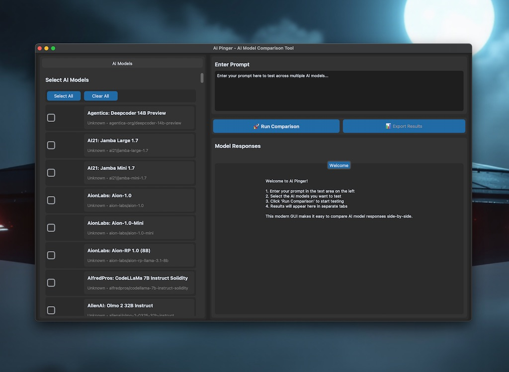

# Calculator 🧮

> Modern Desktop Calculator - Clean, fast, and intuitive calculations


[](https://opensource.org/licenses/MIT)
[](https://www.electronjs.org/)
[](https://nodejs.org/)
[](https://github.com/sanchez314c/calculator/releases)

## 📸 Main Interface


> A beautiful, professional calculator designed for modern desktops with an elegant dark interface

Calculator is a sleek desktop application that brings together style and functionality. Built with Electron, it provides a beautiful dark-themed interface that's easy on the eyes and powerful enough for all your calculation needs. Perfect for everyday use with fast performance and intuitive controls.

## ✨ Features

- 🧮 **Core Calculator Functions** - All basic operations: addition, subtraction, multiplication, division
- 🎨 **Beautiful Dark UI** - Modern, responsive interface that's easy on the eyes
- ⚡ **Instant Calculations** - Fast performance with smooth animations
- ⌨️ **Full Keyboard Support** - Complete keyboard navigation and shortcuts
- 🖱️ **Intuitive Mouse Control** - Click-based operation with clear visual feedback
- 🪟 **Window Management** - Resizable window with proper scaling
- 🚀 **Native Performance** - Built with Electron for optimal cross-platform performance
- 🖥️ **Cross-Platform** - Works on macOS, Windows, and Linux
- 🎯 **Precision Handling** - High-precision calculations with proper rounding
- ❌ **Error Handling** - Clear error messages for invalid operations

## 📸 Screenshots

<details>
<summary>View Screenshots</summary>


*Main calculator interface with dark theme and clean layout*

</details>

## 🚀 Quick Start - One-Command Build & Run

### Option 1: One-Command Solution (Recommended)

```bash
# Clone and build
git clone https://github.com/sanchez314c/calculator.git
cd calculator

# Build and run with a single command!
npm run build && npm start
```

### Option 2: Development Mode

```bash
# Run in development mode with hot reload
npm run dev
```

### Build Options

```bash
# Build only (don't launch)
npm run build

# Build for specific platform
npm run build-mac      # macOS build
npm run build-win      # Windows build
npm run build-linux    # Linux build

# Build for all platforms
npm run dist:maximum   # Build for all platforms and architectures
```

## 📋 Prerequisites

For running from source:
- **Node.js** 18+ and npm
- **Git** (for cloning)

The application will guide you through installing any missing dependencies.

## 🛠️ Installation

### Detailed Installation

```bash
# Clone the repository
git clone https://github.com/sanchez314c/calculator.git
cd calculator

# Install dependencies
npm install

# Start the application
npm start
```

### Building from Source

```bash
# One-command build for current platform
npm run build

# Build for all platforms
npm run dist:maximum

# Build for specific platforms
npm run build-win      # Windows
npm run build-mac      # macOS
npm run build-linux    # Linux
```

### Build Output Locations

After building, find your executables in:
- **macOS**: `dist/Calculator-*.dmg` and `dist/mac*/Calculator.app`
- **Windows**: `dist/Calculator Setup *.exe`
- **Linux**: `dist/Calculator-*.AppImage` and `dist/*.deb`

## 📖 Usage

### 1. Starting the Application

- **Pre-built Binary**: Just double-click the application
- **From Source**: Run `npm start`

### 2. Basic Operations

**Mouse Control:**
- Click number buttons and operation keys (+, -, ×, ÷)
- Click the equals button (=) or press Enter for results
- Use the Clear button (C) to reset

**Keyboard Shortcuts:**
- **Numbers**: 0-9
- **Operations**: +, -, *, /
- **Equals**: Enter or =
- **Clear**: Escape or C
- **Decimal**: .
- **Backspace**: Backspace

### 3. Advanced Features

- **Precision Handling**: Results maintain appropriate decimal precision
- **Error Handling**: Division by zero shows clear "Error" message
- **Large Numbers**: Displayed in scientific notation when needed

## 🔧 Configuration

### Directory Structure

```
calculator/
├── src/                 # Source code
├── build_resources/     # Build resources and assets
│   ├── icons/          # Application icons
│   └── screenshots/    # Application screenshots
├── scripts/            # Utility scripts
├── dist/               # Build outputs (generated)
└── package.json        # Node.js configuration
```

## 🐛 Troubleshooting

### Common Issues

<details>
<summary>Application won't start</summary>

Ensure you have Node.js 18+ installed and run:
```bash
npm install
npm start
```
</details>

<details>
<summary>Build fails on platform</summary>

Install platform-specific build tools:
- **macOS**: `xcode-select --install`
- **Windows**: Install Visual Studio Build Tools
- **Linux**: `sudo apt-get install build-essential`
</details>

<details>
<summary>Keyboard shortcuts not working</summary>

Click in the calculator window to ensure it has focus, then use keyboard shortcuts.
</details>

## 📁 Project Structure

```
calculator/
├── package.json          # Node.js configuration and dependencies
├── package-lock.json     # Dependency lock file
├── src/                  # Source code
│   ├── main/            # Electron main process
│   ├── renderer/        # Renderer process (UI)
│   └── preload/         # Preload scripts
├── build_resources/      # Build resources and assets
│   ├── icons/           # Platform-specific icons
│   └── screenshots/     # Application screenshots
├── scripts/             # Utility scripts
├── dist/                # Build outputs (generated)
└── README.md            # This file
```

## 🤝 Contributing

Contributions are welcome! Please feel free to submit pull requests or create issues for bug reports and feature requests.

### Development Setup

```bash
# Clone the repo
git clone https://github.com/sanchez314c/calculator.git
cd calculator

# Install dependencies
npm install

# Run in development mode
npm run dev

# Lint code
npm run lint
```

## 📄 License

This project is licensed under the MIT License - see the [LICENSE](LICENSE) file for details.

## 🙏 Acknowledgments

- [Electron](https://www.electronjs.org/) - For making cross-platform development possible
- [Node.js](https://nodejs.org/) - JavaScript runtime
- [electron-builder](https://electron.build/) - Build and packaging system

## 🔗 Links

- [Report Issues](https://github.com/sanchez314c/calculator/issues)
- [Request Features](https://github.com/sanchez314c/calculator/issues/new?labels=enhancement)
- [Discussions](https://github.com/sanchez314c/calculator/discussions)

---

**Calculator v1.0** - Modern Desktop Calculator
Built with AI!